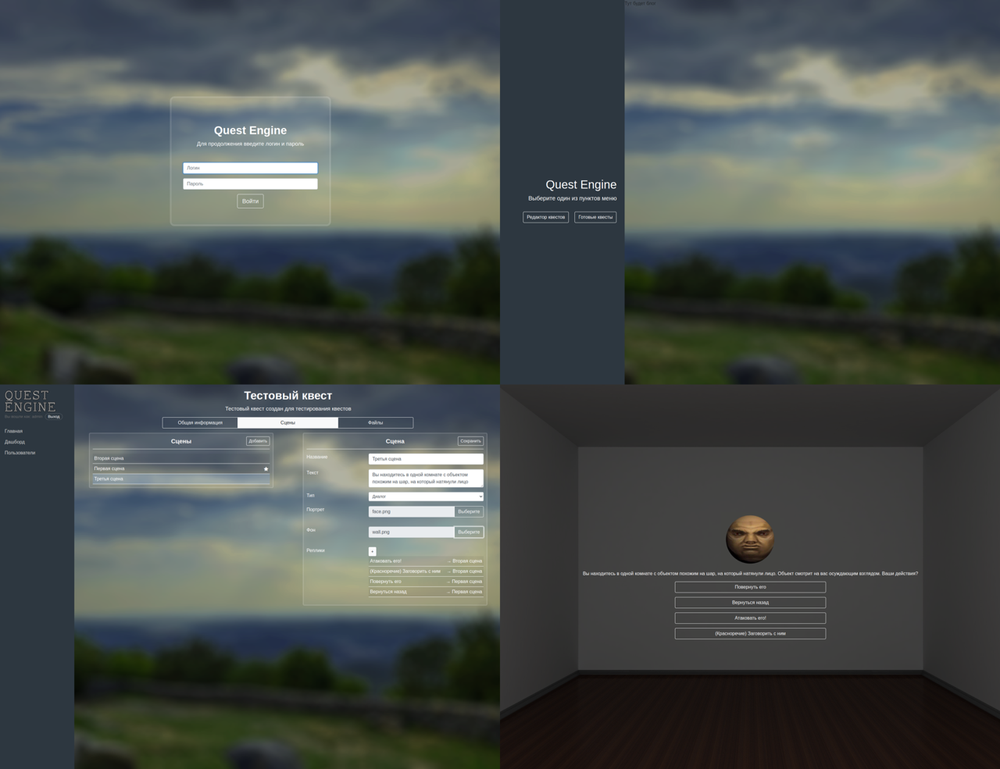

## Quest Engine

Браузерный движок для создания текстовых крестов. 



Идея была в том чтобы создать редактор сцен с ветками диалогов, и дать возможность легко делиться получившимися квестами по ссылке.

### Что использовалось

- Java 8
- Spring 4
- Hibernate 4
- Apache Tomcat 9
- PostgreSQL
- AngularJS 1.5.11
- angular-route-segment
- Bootstrap 4.1.3
- ui-bootstrap4 3.0.4
- Font Awesome 4.7.0

### Сборка и запуск

Процесс сборки описан в `Dockerfile`
```bash
docker build . -t quest-app
```

Для запуска нужно указать настройки подключения к базе данных. Названия переменных описаны в шаблоне `docker-compose.yml`, можно им и воспользоваться:
```bash
docker-compose up -d
``` 

Учетная запись по-умолчанию:  
Логин: `admin`  
Пароль: `admin`  